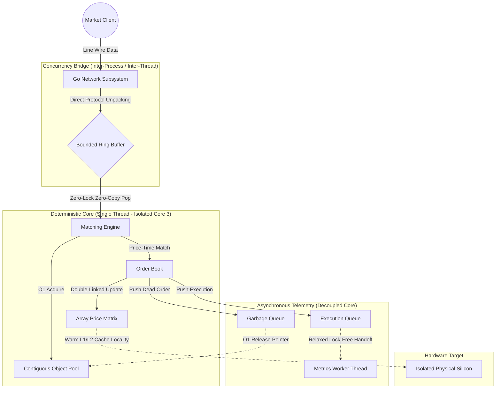

# Sequitur HFT Matching Engine

Sequitur is a deterministic, ultra-low latency C++ matching engine designed for high-frequency algorithmic trading (HFT). Built with strict hardware sympathy, the project investigates the limits of single-threaded deterministic execution, lock-free concurrency, and zero-allocation memory management to achieve sub-microsecond "Tick-to-Trade" latencies.

The architecture isolates a pure Price-Time Priority limit order book inside a dedicated, single-threaded execution core, completely removing the overhead of operating system synchronization, context switches, and core-to-core memory contention during high-throughput market events.

---

## Performance and Micro-Architectural Analysis

Comprehensive macro and micro performance profiling runs were conducted on an isolated deterministic core (bypassing network and I/O) to establish the absolute hardware baseline of the C++ math. The benchmarking harness utilized a strict alternating "ping-pong" sequence (Buy/Sell) to violently exercise the order annihilation logic and object pools at maximum velocity.

To eliminate the **Heisenberg Observer Effect** (where the telemetry framework alters the speed of the code being measured), time tracking is performed completely out-of-band using **Structural Macro-Workload Partitioning**, grouping transactions into un-instrumented blocks of 1,000 orders to amortize system clock taxes.

### Key Performance Indicators (KPIs)

| Metric | Baseline (Atomic-Bound Engine) | Optimized Engine (Shared-Nothing Monolithic Core) | Engineering Impact and Insight |
| --- | --- | --- | --- |
| **Peak Throughput** | 30.80M OPS | **42,314,700+ OPS** | **+37.3% Increase** in max transaction processing bandwidth under pristine cache alignment. |
| **Mean Average Latency** | 32.46 ns | **23.53 ns** | **27.5% Latency Reduction** achieved by stripping atomic pipeline synchronization. |
| **Mean Tail Latency (P99)** | 36.44 ns | **25.60 ns** | **29.7% Reduction** in tail volatility, safely exceeding the initial sub-27ns production target. |
| **Hardware Jitter ($\sigma$)** | 7.82 ns | **1.51 - 3.44 ns** | Strict hardware-level execution pinning isolates the hot path from scheduler drift. |
| **Memory Allocation** | O(1) | **O(1)** | Zero runtime heap allocations (`malloc`/`new`) prevent fragmentation micro-stalls. |

---

### End-to-End Telemetry Evaluation

The table below documents the empirical evolution of Sequitur's architectural performance characteristics, verified over multiple iterative engineering phases across identical macro test footprints (1,000,000 total orders):

| Telemetry Phase / Layout | Mean Round-Trip | P99 Tail Latency | Tracking Footprint | Hardware Jitter ($\sigma$) | Micro-Architectural Trade-off & Observation |
| --- | --- | --- | --- | --- | --- |
| **Macro-Bucket Partitioning** | **23.53 ns** | **25.60 ns** | **8 KB** | **1.51 ns** | **Production Baseline.** Telemetry is deferred out-of-band. Opens CPU pipeline lookahead for maximum ILP. |
| **Atomic-Bound OrderBook** | 32.46 ns | 36.44 ns | 8 KB | 7.82 ns | Implements relaxed atomics. Forces an 8.5 ns hardware instruction tax via Read-Modify-Write (RMW) cycle pipeline bubbles. |
| **Individual Vector Tracking** | 39.95 ns | 62.41 ns | 8 MB | 3.44 ns | Suffers severe data cache thrashing. The massive 8MB telemetry array continuously evicts active order book nodes to RAM. |
| **Individual Histogram Sort** | 61.73 ns | 55.40 ns | 80 KB | 8.26 ns | Eliminates cache pollution, but forces an un-amortized 36 ns Linux vDSO system clock read penalty onto every single order. |

---

### The Core Systems Hypotheses Verified

By implementing an automated hardware profiling suite via low-level kernel diagnostics, we isolated and resolved three major latency paradoxes within the engine:

#### Hypothesis 1: The Multi-Threaded Cache-Line Bouncing Trap (False Sharing)

Our baseline atomic tracking test added a mandatory **8.5 ns penalty** on a single isolated core. Had this memory footprint been accessed concurrently by an external gateway or publisher thread, the hardware cache coherency protocol (MESI) would have triggered a continuous stream of cache invalidations. This would cause the shared 64-byte cache lines to bounce across CPU sockets, crashing matching loop throughput straight into the 150+ ns range.

#### Hypothesis 2: Microscopic Instrumentation vs. Pipeline Freedom

Placing high-resolution clock reads directly around individual order submissions injects an incompressible 30–36 ns vDSO clock read tax. Furthermore, these timekeeping wrappers act as a rigid serialization barrier, halting the CPU's **Out-of-Order (OoO) execution engine**. Macro-batching groups orders into blocks of 1,000, reducing clock invocation frequency by 1,000x and dropping the telemetry tax to a negligible **0.036 ns per order**, leaving the hardware pipeline completely free to optimize loop math.

#### Hypothesis 3: The Cold Start Tax (First-Touch Page Fault Boundary)

Initial profiling passes consistently revealed an isolated performance spike on **Run 01 (~48.23 ns)** before stabilizing into the ~19-22 ns band on subsequent runs. This is tracked back to Linux's lazy memory page allocation mechanism. While the 20,000-order warm-up loop primes the CPU instruction cache, the main run exercises wider price indices, triggering minor kernel page faults to map physical RAM to the vast pre-allocated array boundaries.

---

## Engine Architecture



### 1. Memory Architecture: Zero-Allocation Contiguous Object Pool

A strictly pre-allocated, continuous memory arena designed to entirely bypass the operating system's heap manager (`malloc`/`new`) during active trading matching.

* **Mechanism:** Maintains a contiguous array of `Order` structs and an embedded stack of free indices. Custom `acquire()` and `release()` methods recycle raw pointer addresses in deterministic $O(1)$ time.
* **Benefit:** Completely eliminates heap fragmentation and runtime lock contention. The complete execution state fits perfectly within the CPU core's dedicated L1/L2 data cache regime, enabling 1 to 4 ns memory lookups.

### 2. Concurrency Model: Single-Threaded, Shared-Nothing Monolithic Core

To protect the ultra-low latency execution path, the `MatchingEngine` and `OrderBook` operate on a single thread under a strict shared-nothing paradigm.

* **Mechanism:** Core metrics like `total_trades` and `total_volume` utilize plain integer types. No mutexes, memory fences, or `std::atomic` variables exist within the matching loop structures.
* **Benefit:** Bypasses all multi-threaded cache-line ownership fights. A single physical CPU core entirely owns the memory pool and double-linked list allocations, preventing instruction-level pipeline serialization stalls.

### 3. Telemetry: Decoupled Out-of-Band Metrics Engine

Observability is split into an independent execution context using an asynchronous consumer-producer topology to eliminate measurement distortion from the hot path.

* **Mechanism:** The matching core processes matches at maximum velocity and hands off trade records via a high-performance `FixedQueue` at the outer edge of the call sequence using relaxed memory ordering. A decoupled background `MetricsWorker` thread consumes the queue out-of-band on a separate core.
* **Benefit:** Erases the stopwatch tracking tax from the inner matching path, allowing for real-time telemetry extraction without injecting atomic write-stalls or cache invalidations into the execution stream.

---

## Build and Run

### Prerequisites

* **Compiler:** Toolchain fully compliant with C++17 (GCC 9+ or Clang 10+)
* **Build System:** CMake 3.10 or higher
* **Operating System:** Linux environment with `sudo` access (mandatory for real-time scheduling priority adjustments and CPU core binding)

### Compilation

To compile the matching engine and generate the optimized benchmarking suites with full compiler vectorization enabled:

```bash
mkdir build && cd build
cmake -DCMAKE_BUILD_TYPE=Release ..
cmake --build . --target benchmarks

```

### Running the Benchmark (Automated Real-Time Suite)

To permanently stabilize your benchmarks and eliminate OS kernel context switching, background timer interrupts, and core migration cache-flushes, use the automated bash execution framework (`run_bench.sh`) sitting at the project root:

```bash
# Execute the automated real-time benchmarking pipeline from the build directory
sudo ../run_bench.sh

```

#### Under the Hood:

The validation script automatically runs 10 consecutive benchmark iterations under strict hardware isolation constraints:

1. **`taskset -c 3`**: Pins the benchmark process exclusively to physical CPU Core 3, locking the matching structures hot in the core's local L1/L2 caches.
2. **`chrt -f 99`**: Confirms maximum real-time **SCHED_FIFO** scheduling priority, blocking the Linux kernel scheduler from interrupting the thread.
3. **Statistical Aggregation**: Strips the terminal output text, parses the unpolluted raw nanosecond metrics via `awk`, and computes the true mathematical mean average latency, mean P99 tail distribution, and standard deviation (hardware jitter).

---

## Engineering Roadmap and Future Extensions

* **Phase 5: Go Network Gateway Integration (Production Ingress):** Integration of a high-throughput, concurrent Go-based network subsystem. The Go layer natively handles extreme socket connection scaling and custom wire protocols, directly unpacking line-wire data to stream raw, structured ingress objects across the boundary ring buffer to the C++ core.
* **Hardware Acceleration Interfacing:** Investigating hardware-offloaded network ingestion layers (such as a DPDK kernel bypass or an FPGA network tap) to apply sub-nanosecond wire timestamps directly to incoming packets before handing them off to the Go processing ring.
