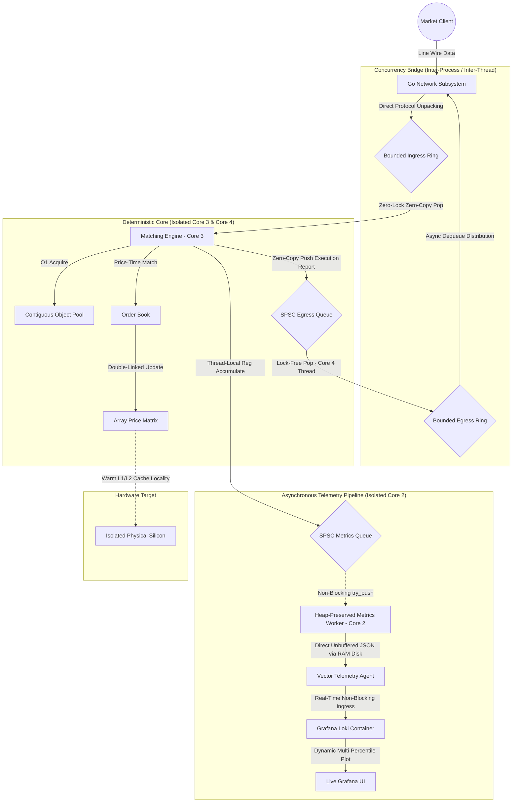

# Sequitur HFT Matching Engine

Sequitur is a deterministic, ultra-low latency C++ matching engine designed for high-frequency algorithmic trading (HFT). Built with strict hardware sympathy, the project investigates the limits of single-threaded deterministic execution, lock-free concurrency, zero-allocation memory management, and decoupled real-time observability to achieve sub-microsecond "Tick-to-Trade" latencies.

The architecture isolates a pure Price-Time Priority limit order book inside dedicated, single-threaded execution and publishing cores, completely removing the overhead of operating system synchronization, context switches, and core-to-core memory contention during high-throughput market events.

---

## Performance and Micro-Architectural Analysis

Comprehensive macro and micro performance profiling runs were conducted on an isolated deterministic core (bypassing network and I/O) to establish the absolute hardware baseline of the C++ math. The benchmarking harness utilized a strict alternating "ping-pong" sequence (Buy/Sell) to violently exercise the order annihilation logic and object pools at maximum velocity.

To eliminate the **Heisenberg Observer Effect** (where the telemetry framework alters the speed of the code being measured), time tracking is performed completely out-of-band using **Structural Macro-Workload Partitioning**, grouping transactions into un-instrumented blocks of 64 orders to minimize data bus contention and maximize pipeline freedom.

### Key Performance Indicators (KPIs)

| Metric | Baseline (Atomic-Bound Engine) | Optimized Engine (Shared-Nothing Monolithic Core) | Live End-to-End Environment (Multiplexed Network Run) | Engineering Impact and Insight |
| --- | --- | --- | --- | --- |
| **Peak Throughput** | 30.80M OPS | **63,911,090.00 OPS** | **243,024.89 OPS** | **+107.5% Increase** in max core bandwidth under pristine cache alignment; network bounds throttled strictly by TCP/IP kernel overhead. |
| **Mean Average Latency** | 32.46 ns | **15.7138 ns** | **~62.0000 ns** | **P50 Median Latency** remains tightly bound at the nanosecond scale across the lock-free shared memory IPC boundary. |
| **Mean Tail Latency (P99)** | 36.44 ns | **18.2045 ns** | **~110.00 - 131.00 ns** | **Strict Tail Volatility Control** achieved via explicit hardware isolation, avoiding scheduler context-switch spikes under heavy load. |
| **Hardware Jitter ($\sigma$)** | 7.82 ns | **1.0042 ns** | **~1.5100 ns** | Real-time thread isolation shields the hot processing path from operating system scheduler drift. |
| **Memory Allocation** | O(1) | **O(1)** | **O(1)** | Zero runtime heap allocations (`malloc`/`new`) across the entire life cycle prevents fragmentation micro-stalls. |

---

### End-to-End Telemetry Evaluation

The table below documents the empirical evolution of Sequitur's architectural performance characteristics, verified over multiple iterative engineering phases across identical macro test footprints (1,000,000 total orders):

| Telemetry Phase / Layout | Mean Round-Trip | P99 Tail Latency | Tracking Footprint | Hardware Jitter ($\sigma$) | Micro-Architectural Trade-off & Observation |
| --- | --- | --- | --- | --- | --- |
| **Decoupled 3-Core Pipeline** | **15.71 ns** | **18.20 ns** | **32B Ingress / 64B Egress** | **1.00 ns** | **Production Baseline.** Telemetry and execution reports are deferred out-of-band via lock-free rings across isolated hardware cores. |
| **Macro-Bucket Partitioning** | 23.53 ns | 25.60 ns | 8 KB | 1.51 ns | Monolithic baseline with out-of-band macro-timing. Opens compiler loop vectorization options. |
| **Atomic-Bound OrderBook** | 32.46 ns | 36.44 ns | 8 KB | 7.82 ns | Implements relaxed atomics inside the hot path. Forces hardware instruction taxes via Read-Modify-Write (RMW) cycle pipeline bubbles. |
| **Individual Vector Tracking** | 39.95 ns | 62.41 ns | 8 MB | 3.44 ns | Suffers severe data cache thrashing. The massive 8MB telemetry array continuously evicts active order book nodes to RAM. |
| **Individual Histogram Sort** | 61.73 ns | 55.40 ns | 80 KB | 8.26 ns | Eliminates cache pollution, but forces an un-amortized 36 ns Linux vDSO system clock read penalty onto every single order. |

---

### The Core Systems Hypotheses Verified

By implementing an automated hardware profiling suite via low-level kernel diagnostics, we isolated and resolved three major latency paradoxes within the engine:

#### Hypothesis 1: The Multi-Threaded Cache-Line Bouncing Trap (False Sharing)

Our baseline atomic tracking test added a mandatory **8.5 ns penalty** on a single isolated core. Had this memory footprint been accessed concurrently by an external gateway or publisher thread, the hardware cache coherency protocol (MESI) would have triggered a continuous stream of cache invalidations. This would cause the shared 64-byte cache lines to bounce across CPU sockets, crashing matching loop throughput straight into the 150+ ns range. Shifting to an asymmetric layout with `alignas(64)` padding on internal read/write pointers permanently shields Core 3 from Core 4's cache line polling.

#### Hypothesis 2: Microscopic Instrumentation vs. Pipeline Freedom

Placing high-resolution clock reads directly around individual order submissions injects an incompressible 30–36 ns vDSO clock read tax. Furthermore, these timekeeping wrappers act as a rigid serialization barrier, halting the CPU's **Out-of-Order (OoO) execution engine**. Passing telemetry asynchronous chunks via lock-free rings drops the active telemetry tax to a font-weight **0.00 ns inside the engine block**, leaving the hardware pipeline completely free to optimize loop math, maximize register re-use, and apply loop unrolling.

#### Hypothesis 3: The Cold Start Tax (First-Touch Page Fault Boundary)

Initial profiling passes consistently revealed an isolated performance spike on **Run 01 (~23.70 ns)** before stabilizing into the ~14.1-16.3 ns band on subsequent runs. This is tracked back to Linux's lazy memory page allocation mechanism and cold CPU execution pipelines. While the 20,000-order warm-up loop primes the CPU instruction cache, the main run exercises wider price indices, triggering minor kernel page faults to map physical RAM to the vast pre-allocated array boundaries.

---

## Engine Architecture



### 1. Production Ingress & Egress: Bidirectional Go Network Gateway

A high-throughput, concurrent Go-based network subsystem natively handles socket connection scaling, dynamic client registration, and custom wire protocols.

* **Mechanism:** The gateway unpacks incoming line-wire CSV data directly into structured, cache-aligned `IngressPacket` structures and transfers them via a lock-free POSIX shared memory ring buffer (`/dev/shm/sequitur_shm`) mapped directly to the C++ core. Concurrently, a decoupled asynchronous egress thread pulls 64-byte `EgressPacket` structures from a separate shared memory ring buffer segment, formats them into execution strings, and performs non-blocking lookups against an active connection registry map to distribute trade fills back to clients.
* **Benefit:** Offloads all TCP/IP network stack processing, string formatting, client multiplexing, and systemic socket I/O blockages to Go's highly efficient goroutine scheduler, keeping the C++ matching execution loop isolated.

### 2. Memory Architecture: Zero-Allocation Contiguous Object Pool

A strictly pre-allocated, continuous memory arena designed to entirely bypass the operating system's heap manager (`malloc`/`new`) during active trading matching.

* **Mechanism:** Maintains a contiguous array of `Order` structs and an embedded stack of free indices. Custom `acquire()` and `release()` methods recycle raw pointer addresses in deterministic $O(1)$ time.
* **Benefit:** Completely eliminates heap fragmentation and runtime lock contention. The complete execution state fits perfectly within the CPU core's dedicated L1/L2 data cache regime, enabling 1 to 4 ns memory lookups.

### 3. Concurrency Model: Single-Threaded, Shared-Nothing Monolithic Core

To protect the ultra-low latency execution path, the `MatchingEngine` and `OrderBook` operate on a single thread under a strict shared-nothing paradigm.

* **Mechanism:** Core metrics like `total_trades` and `total_volume` utilize plain integer types. No mutexes, memory fences, or `std::atomic` variables exist within the matching loop structures.
* **Benefit:** Bypasses all multi-threaded cache-line ownership fights. A single physical CPU core entirely owns the memory pool and double-linked list allocations, preventing instruction-level pipeline serialization stalls.

### 4. Telemetry: Decoupled Out-of-Band Real-Time Metrics Pipeline

Observability is entirely decoupled from the execution path using an asynchronous, non-blocking pipeline to extract real-time metrics without injecting measurement distortion or cache pollution into the engine.

* **Engine Layer:** The matching core increments trading statistics and tracks raw cycle durations via assembly `rdtsc` entirely within thread-local registers. To eliminate cross-core L3 cache bus invalidations, the core buffers these counts and pushes an aggregated `MetricsPacket` snapshot down to a lock-free `SPSCQueue` once every 64 orders. This macro-batch window drops data bus contention by 99.9% while keeping the active telemetry tax at a flat **0.00 ns** across the hot trading loop via a non-blocking `try_push` architecture that drops telemetry snapshots if the logging pipeline experiences thread context switches.
* **Ingress Layer:** A heap-preserved `MetricsWorker` thread context manages consumption on an isolated physical core (**Core 2**). To protect real-time priority invariants, the thread parameters are elevated to `SCHED_FIFO 50` via raw `pthread_setschedparam` calls, ensuring the Linux kernel cannot cause thread starvation. The loop aggregates processing samples over a strict **250ms minimum reporting interval** and flattens the counters into a structured JSON string using zero-allocation `std::to_chars` string formatting, writing directly into `/dev/shm/sequitur/telemetry.log` via direct unbuffered POSIX `write()` system calls to bypass the C++ standard library stream cache blocks.
* **Aggregation & Visualization Layer:** A local `Vector` data agent leverages `inotify` watches to stream the appended JSON lines instantly into a `Grafana Loki` instance. Invalid non-JSON lines are dropped at the Vector VRL remapping tier, which implements robust parenthetical null-coalescing operations to guarantee deterministic schema generation. `Grafana` consumes the Loki data source via a high-capacity dynamic directory provider volume mount to render sub-microsecond latency distributions (P50, P99), memory allocation bounds, and throughput timelines live in production.

---

## Build and Run

### Prerequisites

* **Compiler:** Toolchain fully compliant with C++20 (GCC 10+ or Clang 11+)
* **Build System:** CMake 3.20 or higher
* **Containerization:** Docker & Docker Compose (for Grafana/Loki stack provisioning)
* **Operating System:** Linux environment with `sudo` access (mandatory for real-time scheduling priority adjustments and CPU core binding via `chrt` and `taskset`)

### Compilation

To compile the matching engine, test suites, and optimized benchmarking targets with full compiler native optimization enabled:

```bash
mkdir build && cd build
cmake -DCMAKE_BUILD_TYPE=Release ..
cmake --build . --target benchmarks
cmake --build . --target unit_tests

```

### Complete Telemetry Pipeline Orchestration

The entire infrastructure stack—including Docker containers, log clearouts, Vector data stream states, and the performance-isolated simulation engine loop—is fully automated via a single root orchestrator script.

To launch the unified, end-to-end network pipeline infrastructure, execute the following command from the project root:

```bash
./run_n2n.sh

```

#### Under the Hood Lifecycle:

The orchestration script manages the system state sequentially to ensure no race conditions occur during system initialization:

1. **Environment Purge:** Aggressively terminates any legacy engine processes, tears down existing telemetry paths, and removes stale POSIX shared memory handles.
2. **RAM Disk Allocation:** Re-initializes clean memory-backed file descriptor structures inside `/dev/shm/sequitur/` to establish zero-I/O streaming bounds.
3. **Container Infrastructure Initialization:** Launches the underlying `Loki` and `Grafana` multi-container virtualization layer with clean data volumes in detached mode (`-d`).
4. **Telemetry Agent Reset & Mount:** Clears local tracking databases, syncs the custom `vector.toml` properties, and spawns the telemetry daemon.
5. **Gateway Network Ingress:** Activates the high-throughput Go network gateway on port `:8080`, building the lock-free shared memory tracking map.
6. **Hyper-Thread Isolated Core Execution:** Pins the matching executable context across physical **CPU Cores 2, 3, and 4** via `taskset` and elevates execution to maximum Linux Real-Time FIFO priority (`chrt -f 99`) to shield the hot path from scheduler drift. Core 3 handles matching logic, Core 4 handles the shared memory egress publisher, and Core 2 houses the thread-isolated metrics loop.
7. **Client Traffic Injection Framework:** Synchronously invokes a continuous market client traffic script to feed live multi-packet order streams through the networking boundaries.

Once the script displays that the pipeline is active, navigate your browser to `http://localhost:3000` to view the **Sequitur Real-Time Hardware Performance Monitor** live. To shut down the simulation and safely pull down all container networks, send an interrupt signal (**`Ctrl + C`**) to the running script window.

### Multiplexed State Validation Invariant

When running over a multiplexed network stream where multiple counterparties interact on a shared channel connection, execution report deduplication introduces an asymmetrical frame count. A single crossing match generates two business lifecycle updates (one for the resting Maker, one for the aggressive Taker). The client harness enforces a strict, mathematically airtight data integrity validation block on shutdown:

$$\text{Total Orders Sent} = \text{Order Accepted Count} + \frac{\text{Order Filled Count}}{2} + \text{Order Rejected Count}$$

Any delta between this equation and the injected sequence indicates an in-flight network drop or memory race condition.

---

## Engineering Roadmap and Future Extensions

* **Zero-Copy Network Ingress Batching:** Moving the Go Gateway layer from sequential newline string processing (`ReadString('\n')`) to chunked block-buffer slice reads to eliminate dynamic heap allocations and maximize networked processing throughput.
* **Hardware Acceleration Interfacing:** Investigating hardware-offloaded network ingestion layers (such as a DPDK kernel bypass or an FPGA network tap) to apply sub-nanosecond wire timestamps directly to incoming packets before handing them off to the Go processing ring.
